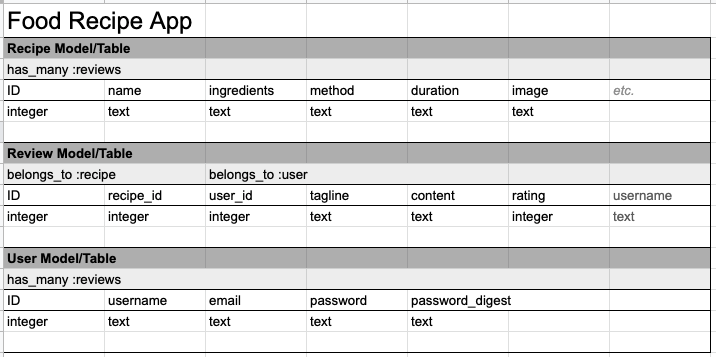

# README

# Project 1: Food Recipe App

### The Food Recipe App

The purpose of the app is to provide cooking tips and simple recipes anyone can make. It's a simple app based on three models; Users, Reviews and Recipes. Users can sign up and log in with a secure password. To create a review about a recipe users must be logged in. This was a simple project for training purposes and still a work in progress.

It was meant to help us learn how to build a website from the ground up using Ruby on Rails combined with html and CSS.The Rails app was then deployed to Heroku.

### Approach

At first the three models were sketched out in Google sheets to determine the appropriate associations, rows and columns. The associations between the three models were simple has_many / belongs_to associations without any join tables. See table below:





Once the models were sketched out they were migrated into Rails, including the user_ID and recipe_ID required to associate reviews with users and recipes.

``` rails db:seed ``` command was used to get it running after creating default values in the seed file. Heroku was used to deploy the app and more content was added afterwards e.g. ingredients and method data

In the Review model, associations had to be optional for the code to work

``` class Review < ApplicationRecord
      belongs_to :recipe, :optional => true
      belongs_to :user, :optional => true
    end ```


## Images Used

The images were pulled from external sources:
Asparagus Risotto: ("https://assets.epicurious.com/photos/57b3389cfd214db6472a3146/2:1/w_1260%2Ch_630/asparagus-risotto.jpg")
Garlic, Lemon and Chilli Fresh Pasta: ("https://food-images.files.bbci.co.uk/food/recipes/spaghetti_with_chilli_89628_16x9.jpg")
Soft Boiled Egg on Sourdough with Spinach and Salsa: ("https://nomoneynotime.com.au/uploads/recipes/_1200x630_crop_center-center_82_none/1805-homemade-baked-beans-with-toast-eggs-and-spinach.jpg?mtime=1543385000")

## Recipes Used

The recipes were written and created by me.

## Heroku Link to The Recipe App

Food Recipe App: ("https://still-fortress-41851.herokuapp.com/recipes/2")

### Bugs / Fixes

- The formatting of the recipes needs to change e.g. bullet points for the ingredients

- While the app mostly works as it should, users are able to delete / edit recipes. These functions are only intended to be used by admin (me). Need to fix code to give users less permissions

- The text fields on the edit recipe page need to be reformatted for easier text entry

- Clicking on reviews doesn't work anymore. Need to fix code to direct the appropriate users to their own reviews which they can edit / delete but not be able to edit / delete reviews they don't own

### Next Steps / Stretch Goals

- De-bugging above issues

- Add more recipes

- Upload my own photos of the dishes to replace the external ones

- Once enough recipes have been added, plan to include a search and a filter option

- More column Recipe options such as vegan/vegetarian/gluten free and difficulty level

- Pdf download option

- Save ingredient list option: Favourites / store recipes for later

- Recipe uploads from users
